### 版本: 1.2.2-JDK17-SNAPSHOT
#### 项目地址：[wu-smart-acw](https://gitee.com/wujiawei1207537021/wu-framework-parent/tree/master/wu-smart-intergration/wu-smart-acw)
#### 演示地址：[演示地址](http://124.222.48.62:30193/wu-smart-acw-ui/index.html#/login)  admin/admin

### docker启动
```yaml
docker run  -d -it -p 18080:18080 -e MAIN_DB_HOST=cloud-mysql:3306 -e MAIN_DB_USERNAME=root -e MAIN_PASSWORD=mysql  --name wu-smart-acw-server registry.cn-hangzhou.aliyuncs.com/wu-lazy/wu-smart-acw-server:1.2.2-JDK17-SNAPSHOT

```

#### [接口文档](http://127.0.0.1:18080/swagger-ui/index.html)

#### [本地启动项目UI](http://127.0.0.1:18080/wu-smart-acw-ui/index.html)

### 功能：

#### 登录:默认账号/密码 admin/admin
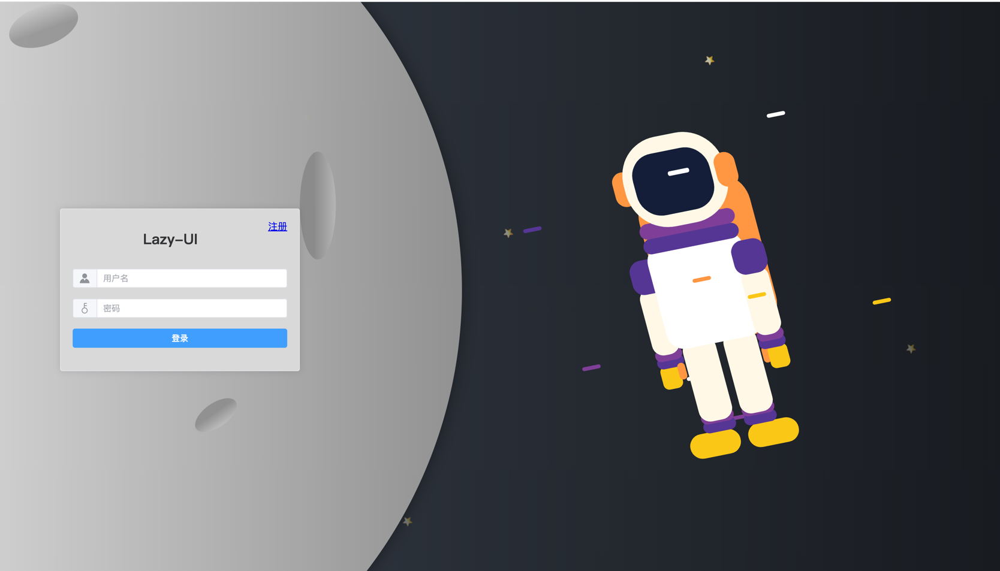

#### 注册 
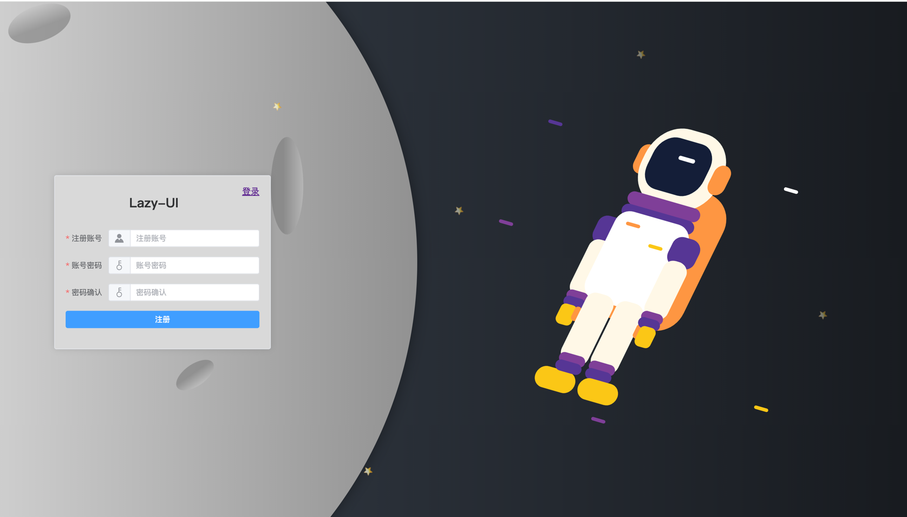

### 系统管理
#### 菜单管理
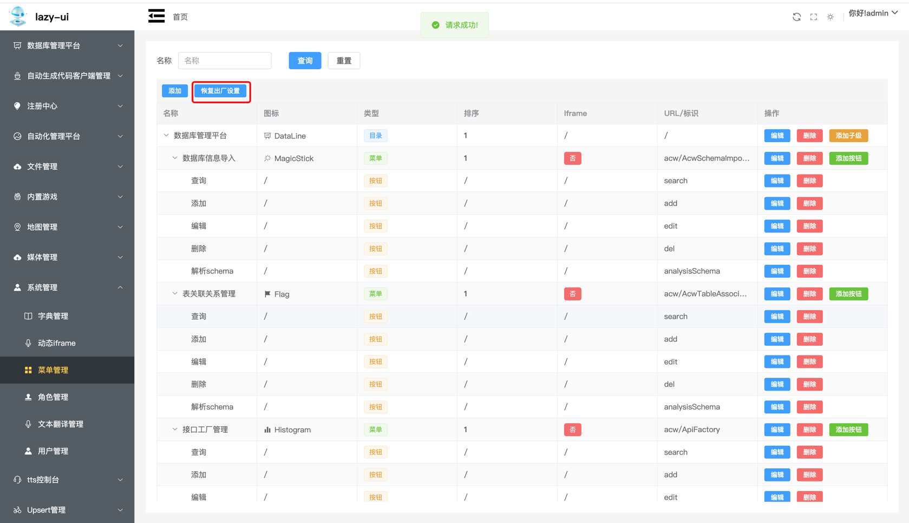
#### 权限管理
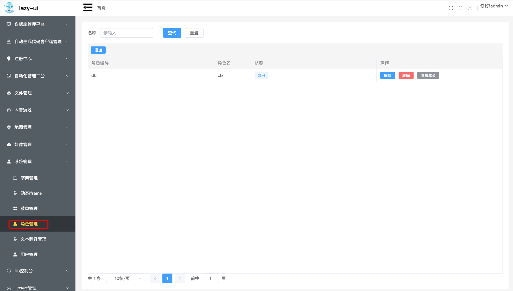
#### 用户管理
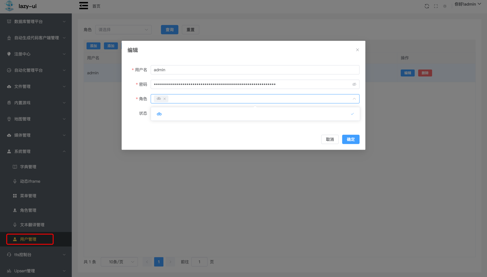

### 数据库管理平台

#### 数据库实例管理
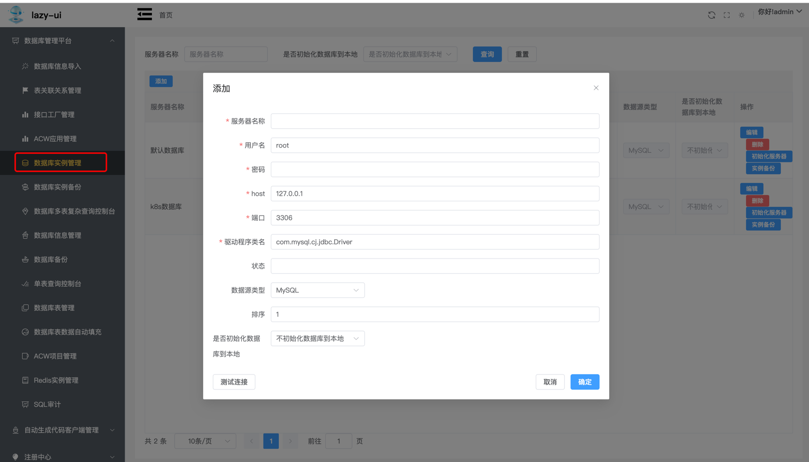

#### 数据库schema管理
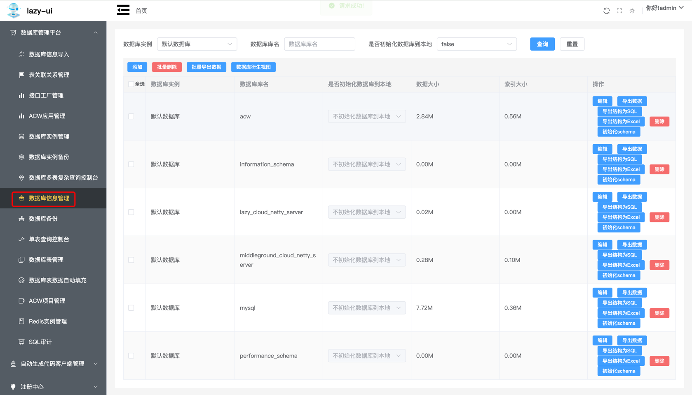

#### 数据库表管理
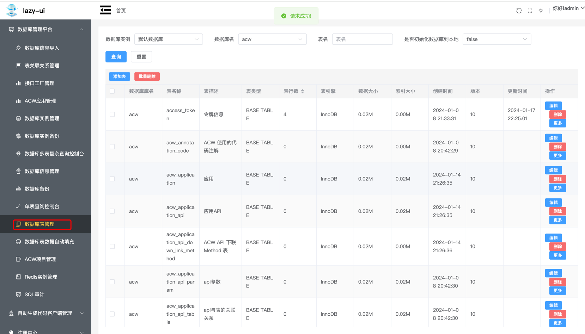

#### 数据库备份、数据库实例备份、数据库导入、导出
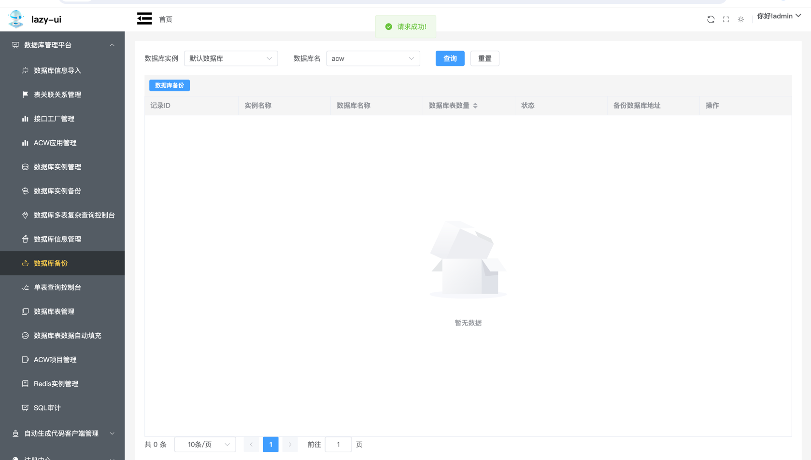
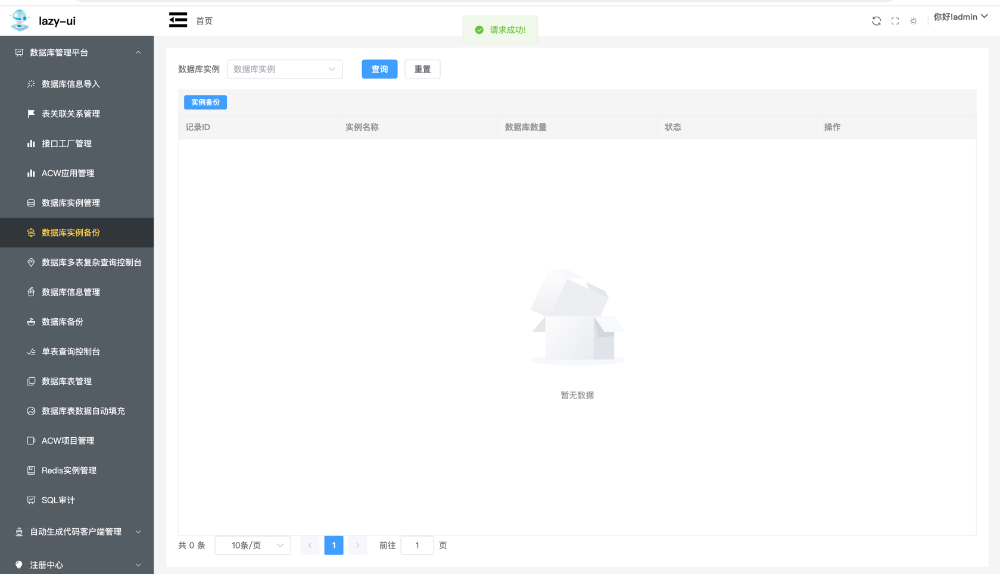
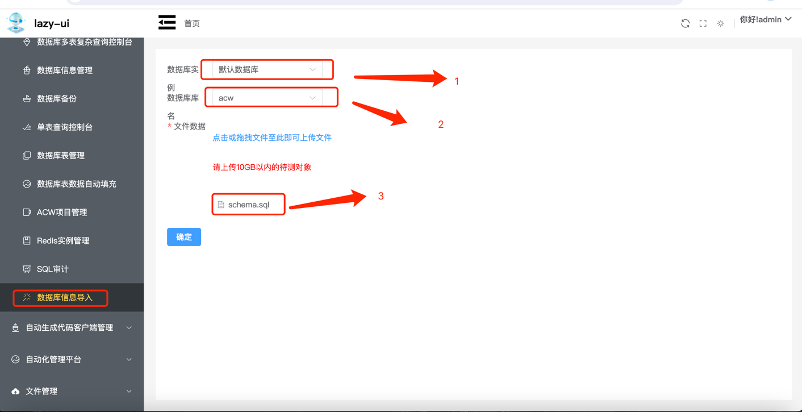

#### 数据库单表操作
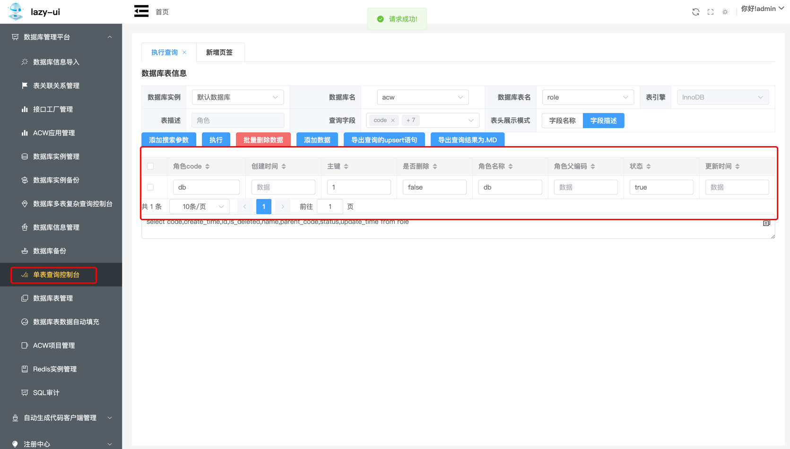

#### 数据库多表操作查询
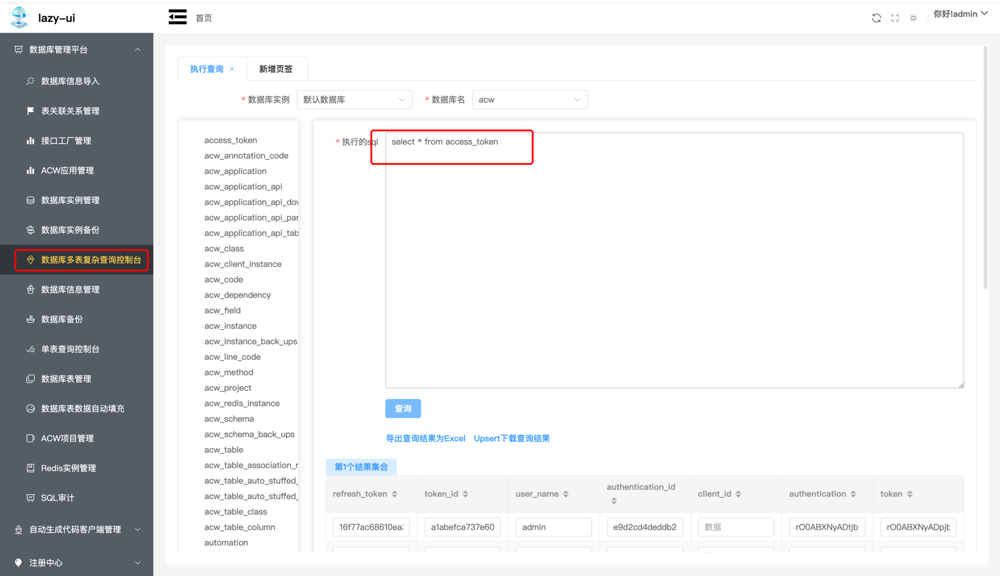

### 上传执行数据库脚本


### Java增删改查代码生成
#### 找到对应菜单
#### 选择你需要的数据实例
#### 选择数据库
#### 选择数据库表
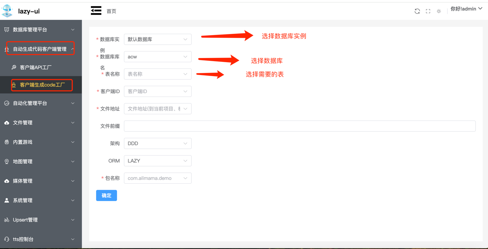


#### 选择客户端（如果是本地ACW服务代码启动默认注册上的客户端ID是 acw-server 如果使用的是acw客户端选择你配置的客户端ID）
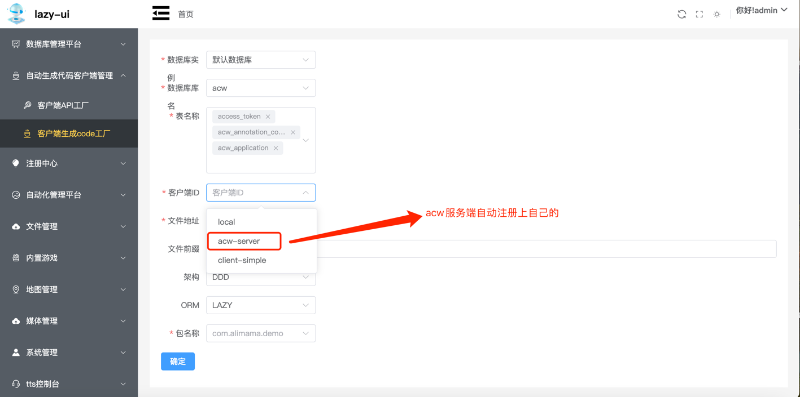
#### 输入你要生成的文件地址（绝对地址 选择到项目所在位置即可，不需要选择到src）
#### 文件前缀（可选择）
#### 选择你项目的架构：DDD、MVC、FEIGN
#### ORM选择：mybatis、Lazy
#### 输入包名称


更新日志:
1. 支持mysql实例添加
2. 支持mysql 数据库查询统计单个表数量
3. 支持mysql单表数据库操作（增删改查）
4. 支持统计单个数据库下所有表条数统计、存储数据
5. 支持mysql数据库自动填充
6. 支持通过数据库反向生成ddd代码
7. 支持数据库备份、数据库实例备份
8. 支持数据库信息导入